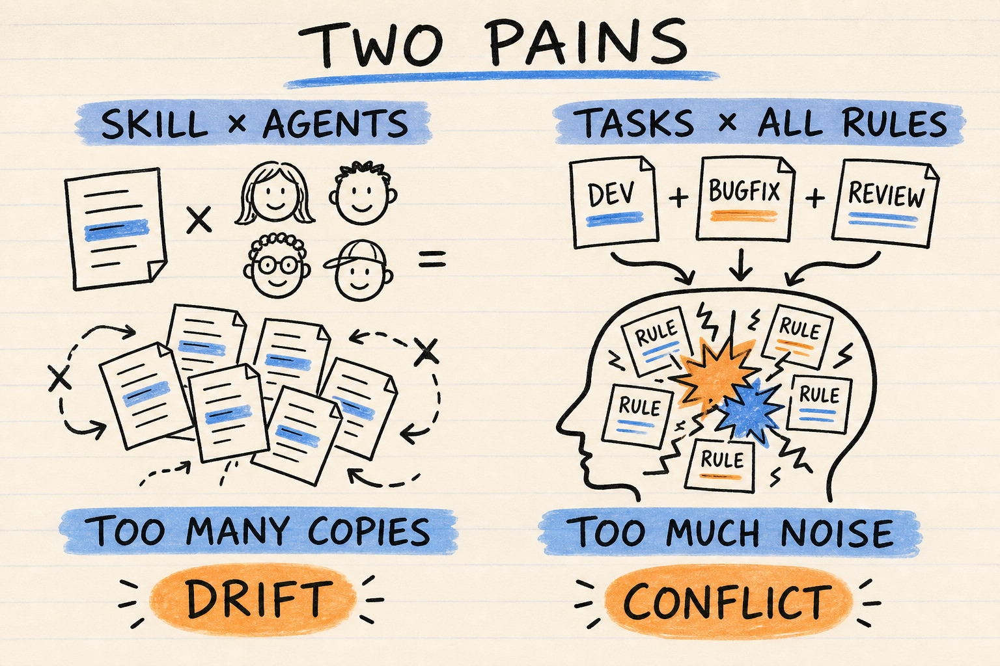
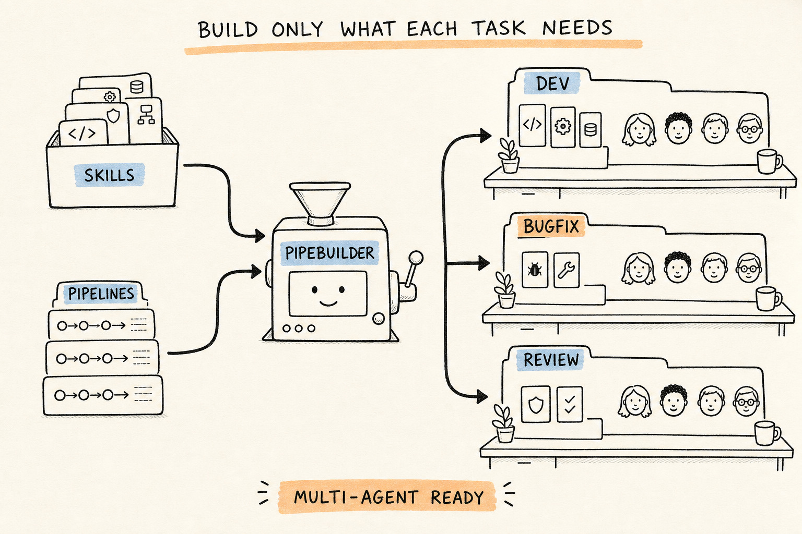

# PipeBuilder

[English](README.md) | [Simplified Chinese](README.zh-CN.md)

[](https://github.com/agentpipe/pipebuilder/actions/workflows/e2e.yml)
[](https://www.python.org/)
[](LICENSE)

> Reuse Agent Skills across coding agents. Give one project multiple task-specific Agent
> pipelines, each with an independently selected capability set.

PipeBuilder is a build-time tool for **cross-agent Skill reuse** and **task-specific AI coding
agent pipelines**. It lets teams define a capability once, reuse its standard Agent Skill
across Cursor, Claude Code, Codex, and CodeBuddy, and keep each task pipeline limited to the
Skills, Rules, Hooks, Commands, and native configuration it actually needs.

## Two Problems PipeBuilder Solves



1. **The same Skill is repeatedly adapted for different coding agents.** Copies drift, fixes
   do not propagate, and platform-native extensions become scattered across repositories.
2. **One project accumulates every Agent capability for every task.** Irrelevant Skills expand
   context, conflicting Rules compete for attention, and unrelated Hooks can run during the
   wrong workflow.

## Build Only What Each Task Needs



PipeBuilder combines reusable capability packs with PipeSpace declarations, then compiles only
the selected capabilities into each target Agent's native format. Development, bug fixing,
review, and release can each have their own focused configuration without duplicating the
project or loading every capability everywhere.

PipeBuilder is a configuration compiler, not a CI/CD pipeline or multi-Agent runtime
orchestrator. It generates files that each coding agent already understands.

## Reuse Agent Skills Across Coding Agents

A reusable capability pack keeps the portable Agent Skill and optional platform-native
extensions together:

```text
shared-skills/bugfix-review/
├── SKILL.md                          # portable Skill shared across agents
├── scripts/
├── references/
└── .pipe-agents/                    # optional platform-native extensions
    ├── codex/AGENTS.md
    ├── cursor/.cursor/rules/
    ├── codebuddy/.codebuddy/settings.json
    └── claude-code/.claude/settings.json
```

- `SKILL.md`, scripts, references, and assets form the portable Skill installed into each
  agent's standard Skill directory.
- `.pipe-agents/<agent>/` preserves the original native format for that agent. PipeBuilder
  projects it through the matching Adapter instead of pretending Rules or Hooks translate
  losslessly between platforms.
- Folder and Git **Skill Providers** let teams share complete capability packs. Git Providers
  resolve a branch or tag to a locked commit for reproducible builds.

The result is one maintained source for a cross-agent Skill, with native differences kept
beside it instead of copied into every project and Agent directory.

## One Project, Multiple Task-Specific Agent Pipelines

A **PipeSpace** is a task-specific Agent pipeline root decoupled from the business-code
`<project>`. Every PipeSpace independently selects its agents, Skills, tags, Skill Providers,
and PipeSpace-native overrides, while its workspace file references the same project:

```text
project/
├── ...                              # business code
└── pipespaces/
    ├── shared/skills/               # reusable cross-agent capability packs
    ├── feature-development/         # feature Skills and Agent configuration
    ├── bugfix-review/               # diagnosis and review capabilities
    └── release/                     # release-only capabilities
```

Keeping `pipespaces/` inside the project is the recommended starting layout. Generated Agent
configuration stays in each PipeSpace rather than polluting the project root:

```text
Skill Providers + PipeSpace-local Skills + PipeSpace Agent overrides
                              |
                 pipespace.json selects a subset
                              |
                              v
                   PipeBuilder Adapter plan
                              |
                              v
       native Skills / Rules / Hooks / configuration per Agent
```

This gives feature development, bug fixing, code review, and release work independent
capability sets without duplicating the project or loading every Skill into one Agent
workspace.

> A PipeSpace isolates Agent configuration, context, and capability composition; it does not
> isolate code writes. Use Git branches, worktrees, or independent clones when agents modify
> the same project in parallel.

## Bootstrap PipeBuilder and the First PipeSpace

Create the shared Skill Provider inside the project and extract the latest Release there:

```text
<project>/pipespaces/
├── shared/skills/pipebuilder/
└── <project>-dev/
```

macOS or Linux:

```bash
PROJECT_ROOT="/path/to/project"
SHARED_SKILLS="${PROJECT_ROOT}/pipespaces/shared/skills"
mkdir -p "${SHARED_SKILLS}"
curl -fsSL "https://github.com/agentpipe/pipebuilder/releases/latest/download/pipebuilder-skill.zip" -o /tmp/pipebuilder-skill.zip
unzip -qo /tmp/pipebuilder-skill.zip -d "${SHARED_SKILLS}"
```

PowerShell:

```powershell
$ProjectRoot = "C:\path\to\project"
$SharedSkills = Join-Path $ProjectRoot "pipespaces/shared/skills"
New-Item -ItemType Directory -Force $SharedSkills | Out-Null
Invoke-WebRequest "https://github.com/agentpipe/pipebuilder/releases/latest/download/pipebuilder-skill.zip" -OutFile "$env:TEMP/pipebuilder-skill.zip"
Expand-Archive "$env:TEMP/pipebuilder-skill.zip" -DestinationPath $SharedSkills -Force
```

Create the first project-local PipeSpace. The relative paths are resolved from the new
PipeSpace:

```bash
PROJECT_NAME="project"
SPACE="${PROJECT_ROOT}/pipespaces/${PROJECT_NAME}-dev"
BUILDER="${SHARED_SKILLS}/pipebuilder/pipebuilder.py"
python3 "${BUILDER}" init "${SPACE}" \
  --name "${PROJECT_NAME}-dev" \
  --project ../.. \
  --shared-skills ../shared/skills
python3 "${BUILDER}" check "${SPACE}"
python3 "${BUILDER}" explain "${SPACE}"
python3 "${BUILDER}" build "${SPACE}" --dry-run
python3 "${BUILDER}" build "${SPACE}"
python3 "${BUILDER}" verify "${SPACE}"
```

`init` writes the workspace folder inventory, configures the shared folder Provider, and
selects `pipebuilder`. The first build projects the Skill into every configured Agent.

PipeSpaces may also live outside the project. Keep the shared Skills and PipeSpaces together,
then pass `--project` and `--shared-skills` paths relative to the new PipeSpace.

Update the shared Skill from the latest Release with:

```bash
python3 <project>/pipespaces/shared/skills/pipebuilder/scripts/update.py
```

## Standalone CLI Quick Start

Runtime requires only Python 3.7+ and the single `pipebuilder.py` file. Git is required only
when using a Git Skill Provider. No third-party Python packages are required.

```bash
curl -O https://raw.githubusercontent.com/agentpipe/pipebuilder/main/pipebuilder.py
python3 pipebuilder.py --version

python3 pipebuilder.py init ./demo-space
python3 pipebuilder.py check ./demo-space
python3 pipebuilder.py build ./demo-space --dry-run
python3 pipebuilder.py build ./demo-space
```

`init` creates an empty scaffold with no external Skills:

```text
demo-space/
├── pipespace.json
└── demo-space.code-workspace
```

For a structured build plan, run
`python3 pipebuilder.py explain ./demo-space --format json`. To try capability selection and
cross-agent projection, continue with the multi-pipeline team example below.

## Run the One-Project, Multiple-Pipelines Example

The repository's
[examples/multi-pipeline-project](examples/multi-pipeline-project)
contains one example project, shared capability packs, and two PipeSpaces with different
capability selections:

```bash
git clone https://github.com/agentpipe/pipebuilder.git
cd pipebuilder

python3 pipebuilder.py check examples/multi-pipeline-project/pipespaces/feature-development
python3 pipebuilder.py check examples/multi-pipeline-project/pipespaces/bugfix-review

python3 pipebuilder.py explain examples/multi-pipeline-project/pipespaces/feature-development
python3 pipebuilder.py build examples/multi-pipeline-project/pipespaces/feature-development
```

After the build, platform configuration is generated only in the selected PipeSpace. The
referenced `project/` is not modified:

```text
feature-development/
├── AGENTS.md
├── .agents/skills/feature-implementation/
├── .cursor/
│   ├── rules/
│   └── skills/feature-implementation/
└── .pipebuilder/lock.json
```

Open `feature-development.code-workspace` in Cursor. For Codex, start the client from
`feature-development/`. Both clients see the `pipeline` and `project` workspace folders and
load the configuration generated for the current pipeline.

For a compact four-agent input with independently reviewed expected output, see
[examples/all-agents-golden](examples/all-agents-golden). It is the public source of truth for
the static E2E example copied into temporary test sandboxes.

## How a PipeSpace Works

Every PipeSpace contains at least one declaration file and one VS Code/Cursor workspace file:

```text
feature-development/
├── pipespace.json
└── feature-development.code-workspace
```

`pipespace.json` selects target agents, Skills, tags, and Skill Providers:

```json
{
  "schema": "pipespace.v1",
  "name": "feature-development",
  "agents": ["codex", "cursor"],
  "skills": ["feature-implementation"],
  "tags": [],
  "skillProviders": [
    {"type": "folder", "path": "../../shared-skills"}
  ]
}
```

PipeSpace-local reusable Skills live in `.pipebuilder/skills/` and take the highest source
priority. Pipeline-specific native Agent configuration lives in
`.pipebuilder/agents/<agent>/`; it complements the shared capability packs selected from
Skill Providers.

The workspace file includes the PipeSpace itself and one or more external project folders.
The `pipeline` folder lets clients discover native configuration generated at the PipeSpace
root, while the `project` folder points to the project:

```json
{
  "folders": [
    {"name": "pipeline", "path": "."},
    {"name": "project", "path": "../../project"}
  ]
}
```

Build flow:

```text
capability packs + PipeSpace declaration + workspace file
                            |
                            v
                     PipeBuilder plan
                            |
                            v
       native Skills / Rules / Hooks / configuration per agent
                            |
                            v
                  .pipebuilder/lock.json
```

`lock.json` records Skill Providers, Skills, sources, target files, and digests. `clean`
deletes only generated files that a valid lock proves belong to PipeBuilder; it does not guess
ownership of other files.

## Current Support

PipeBuilder 0.1.4 requires Python 3.7+ and supports all three major desktop platforms:

| Platform | Status | Tested versions |
| --- | --- | --- |
| Linux | Supported | Python 3.7, 3.14 |
| Windows | Supported | Python 3.7, 3.9, 3.11, 3.13, 3.14 |
| macOS | Supported | Python 3.7, 3.14 |

Four Agent Adapters are included:

| Agent | Status | Current generation capabilities |
| --- | --- | --- |
| Codex | Supported (`client-verified`) | Skills, `AGENTS.md`, config/agents/MCP, Hooks, Rules |
| Cursor | Supported (`client-verified`) | Skills, workspace Rule, Rules, Commands |
| Claude Code | Supported (`client-verified`) | Skills, `CLAUDE.md`, Rules, Commands, Agents, Settings/Hooks, MCP |
| CodeBuddy | Preview (`generated-only`) | Skills, fixed workspace Rule, Commands, Agents, Settings/Hooks, MCP |

`client-verified` means validation has run in a real client. `generated-only` means generated
output and supported structure have been validated, but real-client E1 has not been
established. The status is recorded in `explain` and `.pipebuilder/lock.json`.

## Skill Sources and Skill Providers

PipeBuilder resolves Skills from one implicit local source and two configured Provider types:

1. `.pipebuilder/skills/`: the implicit `space-local` source for the current PipeSpace, with
   the highest precedence. It is not an entry in `skillProviders[]`; when the directory is
   absent, no empty Provider record is emitted.
2. Folder Skill Provider: a configured Provider that references a shared capability folder on
   the local machine or in a repository.
3. Git Skill Provider: a configured Provider that fetches a capability repository by branch
   or tag and pins the resolved commit in the lock.

Folder Skill Provider:

```json
{
  "type": "folder",
  "path": "../../shared-skills"
}
```

Git Skill Provider:

```json
{
  "type": "git",
  "url": "https://example.com/team/agent-skills.git",
  "tag": "v1.0.0",
  "subdir": "skills"
}
```

The Git cache is stored in `.pipebuilder/cache/git/` inside the current PipeSpace. `--offline`
uses only the existing lock and local immutable snapshot without remote access. Authentication
is delegated to a Git credential helper or SSH agent; never put credentials in
`pipespace.json`.

A Skill Provider may declare `build: {args, output}`. A real build executes it before
Skill discovery and projects from the declared output directory after a zero exit.
`check`, `explain`, and `build --dry-run` do not execute Skill Builders. On a fresh source where
the declared output does not exist yet, run `build` first; subsequent `check` calls inspect that
output without rebuilding it.
Skill projection roots are closed generated namespaces: `verify` rejects extra, missing, unsafe,
or changed files, and the next real `build` removes stale files absent from the Builder output.
A Provider may
alternatively declare a post-build command. `check`, `explain`, and
`build --dry-run` only display them; only a real `build` invokes them.
Use `build --require-no-post-commands` for a fail-closed pure projection build:
PipeBuilder exits with `PB018` before its first write if any selected Provider
declares a post command.

## Common Commands

Single PipeSpace:

```bash
python3 pipebuilder.py init [SPACE]
python3 pipebuilder.py check [SPACE]
python3 pipebuilder.py explain [SPACE] --format json
python3 pipebuilder.py build [SPACE] [--offline] [--dry-run] [--require-no-post-commands]
python3 pipebuilder.py verify [SPACE]
python3 pipebuilder.py clean [SPACE]
```

Every command uses the same `pipespace.json`. By default, PipeBuilder automatically finds nested
PipeSpaces within three directory levels and operates on the complete hierarchy. Configure the
depth with `"children": {"scanDepth": N}` or set it to `0` for root-only operation. Hidden,
generated, and symlinked directories are skipped.

There is no separate Tree manifest or command family. When nested PipeSpaces are found,
read-only planning covers every member before writes; `build` applies root to children,
`verify` checks the aggregate hierarchy receipt and every member, and `clean` removes children
before the root.

Automation should use `--format json` and depend on stable diagnostic codes in
`pipebuilder-report.v1` instead of parsing human-readable messages.
For root-only operation, successful JSON `verify` exposes `details.receiptDigest` for the exact
verified `.pipebuilder/lock.json`; it does not create a redundant one-member aggregate receipt.

## Ownership and Safety Boundaries

Human-maintained inputs:

- `pipespace.json` and `<name>.code-workspace`
- `.pipebuilder/skills/`
- `.pipebuilder/agents/<agent>/`
- standard Skills and `.pipe-agents/<agent>/` in Skill Providers

Builder-managed outputs:

- `AGENTS.md`, `CLAUDE.md`
- `.agents/skills/`
- `.codex/`, `.cursor/`, `.codebuddy/`, `.claude/`
- `.mcp.json`
- `.pipebuilder/generated/` and `.pipebuilder/lock.json`

Do not maintain generated files directly. Move content that must persist to the corresponding
source, then run `build` again. Files not registered by the current plan or an old lock are not
modified.

## Documentation

Start with the [documentation index](docs/README.md):

- [PipeSpace and Skill Provider specification](docs/pipebuilder-space-json-spec.md)
- [Four-agent Adapter specification](docs/pipebuilder-agent-adapters.md)
- [E2E guide](tests/e2e/README.md)
- [E2E coverage matrix](tests/e2e/COVERAGE.md)

## Development and Testing

All tests invoke the final release file through subprocesses; they do not import production:

```bash
python3 tests/e2e/run.py --tier offline --jobs 4
python3 tests/e2e/run.py --tier client --agent codex --require
python3 tests/e2e/run.py --tier live --agent codex --require
```

[GitHub Actions](https://github.com/agentpipe/pipebuilder/actions/workflows/e2e.yml) runs the E0
platform matrix listed above. The repository also includes installed-client E1 cases for
Codex, Cursor, and Claude Code, but those cases currently run only in environments where the
clients are installed; they are not part of the hosted GitHub Actions workflow. CodeBuddy
remains `generated-only`.

## Releasing

Set `VERSION` in `pipebuilder.py` and keep the documented version and version contract test
in sync. After the main E0 workflow passes, create and push the matching tag:

```bash
git tag -a v0.1.4 -m "PipeBuilder v0.1.4"
git push origin v0.1.4
```

The release workflow reruns the complete E0 platform matrix, verifies that the tag matches
`VERSION`, and publishes `pipebuilder.py`, `pipebuilder.py.sha256`,
`pipebuilder-skill.zip`, and `pipebuilder-skill.zip.sha256`. The Skill updater verifies the
ZIP checksum before replacing installed files. An existing tag can also be released or
retried through the workflow's manual dispatch input.

## License

[MIT License](LICENSE)
